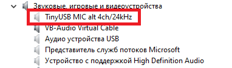

# STM32F103C6/STM32F103C8 USB audio recorder

Проект предназначен для превращения МК (микроконтроллеров) в аудиоустройство записи ("микрофон"). Назначение полученного устройства - оцифровка аналоговых сигналов встроенным АЦП и передача их хосту в виде потока 16-битных аудиоданных.
Проверено на STM32F103C6,  STM32F103C8, STM32F103RB.
Устройство принадлежит стандартному классу Audio 2.0 Device, и для большинства современных ОС не требует драйверов.

Проект написан с использованием библиотеки [tinyUSB](https://github.com/hathach/tinyusb) 0.18.0 и основан на входящих в неё [примерах](https://github.com/hathach/tinyusb/tree/master/examples/device/audio_4_channel_mic).

Устройство может оцифровывать от 1 до 10 каналов. Максимальная частота дискретизации зависит от количества каналов, и составляет от 10кГц для 10 каналов до 96кГц для 1 канала (узким местом здесь является USB-интерфейс, точнее малый объём буфера на указанных МК: из 512 байт 64 используются для endpoint 0, оставшееся делится пополам, что бы передавать аудиоданные в чётных/нечётных кадрах USB).

Устройство не позволяет выбирать количество каналов и частоту дискретизации. Эти параметры задаются перед компиляцией в файле [tusb_config.h](./inc/tusb_config.h) при помощи определений:
**CFG_TUD_AUDIO_FUNC_1_N_CHANNELS_TX** - количество каналов, 1 - 10
**CFG_TUD_AUDIO_FUNC_1_SAMPLE_RATE** - частота дискретизации.

## Готовые сборки

В директории [./bin/Release](./bin/Release/no_mute/) есть несколько (113) готовых hex-файлов для прошивки, с разными комбинациями частот дискретизации и количества каналов. Значение этих параметров понятно из названия файла: например *f103c6_tinyUSB_audio_mic_01_04ch_16kHz.hex* значит, что устройство с этой прошивкой будет 4-канальным с частотой дискретизации 16кГц. Для удобства поиска hex-файлы сгруппированы по директориям в зависимости от количества каналов.

## Чередование (alternating)

АЦП внутри МК всего один, он оцифровывает напряжение на всех каналах по очереди. В составе АЦП МК есть устройство выборки-хранения (УВХ) на конденсаторе малой ёмкости. Во время короткой по времени выборки этот конденсатор не всегда успевает перезарядиться до нового напряжения, и на кондесаторе остаётся часть напряжения от предыдущего канала, искажая результат. Это влияние тем больше, чем выше выходное сопротивление источника напряжения.
Для уменьшения этого влияния можно чередовать напряжения со входов МК со внутренним источником постоянного напряжения. Если без чередования каналы будут оцифровываться в порядке 1-2-3-4..., то с чередованием будет такая послдеовательность 1-П-2-П-3-П-4-П-... (здесь П - это постоянное внутреннее напряжение). Включается это установкой определения **CFG_ADC_ALTERNATION_EN** в [tusb_config.h](./inc/tusb_config.h) в ненулевое значение. Работает при количестве каналов от 2 до 8 (при 1 канале это не нужно, а АЦП за 1 раз может оцифровать не более 16 каналов, что даёт 8 с включенным перемежением).
Наличие чередования в готовых прошивках обозначено суффиксом "_alt" в имени файла:
[f103c6_tinyUSB_audio_mic_01_04ch_16kHz.hex](./bin/Release/no_mute/04ch/f103c6_tinyUSB_audio_mic_01_04ch_16kHz.hex) - без чередования
[f103c6_tinyUSB_audio_mic_01_04ch_16kHz_alt.hex](./bin/Release/no_mute/04ch/f103c6_tinyUSB_audio_mic_01_04ch_16kHz_alt.hex) - с чередованием

## Управляющие входы 

Три вывода МК отведены для управления некоторыми параметрами оцифровки. Внутренними резисторами они подтянуты к логической "1", для изменения нужно подать на них лог. "0" (соединить с "-" питания).

**PB12** - 1 - передача хосту реальной оцифровки, 0 - сигнал с внутреннего иммитатора.
Не всегда с первого раза получается получить исходный сигнал без обработки. Некоторые программы любят делать [ресемплинг](https://ru.wikipedia.org/wiki/%D0%9F%D0%B5%D1%80%D0%B5%D0%B4%D0%B8%D1%81%D0%BA%D1%80%D0%B5%D1%82%D0%B8%D0%B7%D0%B0%D1%86%D0%B8%D1%8F#%D0%9F%D1%80%D0%B8_%D0%BE%D0%B1%D1%80%D0%B0%D0%B1%D0%BE%D1%82%D0%BA%D0%B5_%D0%B7%D0%B2%D1%83%D0%BA%D0%B0) сигнала при несовпадении частот дискретизации устройства с таковой у программы. Для обнаружения этого был добавлен иммитатор, который отдаёт хосту что-то типа битов двоичного счётчика: в канале 1 отсчёты представляют собой последовательность +1, -1, +1, -1,... (+1 и -1 - это соотв. максимальное и минимальное значение сигнала), в канале 2 будет +1, +1, -1, -1,.. При просмотре таких сигналов в аудиоредакторе легко можно обнаружить факт ресемплинга.

**PB13** - 1 - почти полный размах знакового 16-битного сигнала (-32768 .. +32752); 0 - размах 12-битового беззнакового (0..4095) сигнала.
АЦП в МК является 12-битным, что даёт диапазон значений от 0 до 4095. Аудиосигнал 16 бит принимает значения в диапазоне -32768..+32767. В зависисмости от того, какой сигнал нужен, подаём на этот вывод 0 или оставляем в воздухе. Влияет как на реальный сигнал, так и на сигнал иммитатора.

**PB14** - 1 - усреднение сигнала по нескольким выборкам, 0 - одиночная выборка.
АЦП делает макимальное количество преобразований в единицу времени, это зависит от количества каналов. При 1 канале оцифровка происходит с частотй 192кГц, и при частоте дискретизации аудио 1кГц получается 192-кратный оверсемплинг.
В зависимости от этого управляющего входа, хосту будет отдаваться либо среднее значение от 192 выборок, либо значение одной.
При усреднении уменьшается влияние частот, превышающих частоту [Найквиста](https://ru.wikipedia.org/wiki/%D0%A7%D0%B0%D1%81%D1%82%D0%BE%D1%82%D0%B0_%D0%9D%D0%B0%D0%B9%D0%BA%D0%B2%D0%B8%D1%81%D1%82%D0%B0) (не полноценная, конечно, цифровая фильтрация, но лучше чем ничего).
Режим без усреднения может быть полезен, если при малой частоте дискретизации нужно оцифровать узкополосный сигнал, выходящий за пределы частоты Найквиста. При этом происходит снос спектра сигнала вниз, в эти пределы.

## Подтяжка линии D+ USB

В использованных МК нет встроенной подтяжки линии D+ к 3.3в через резистор 1.5кОм, требуется резистор внешний. На платах "[bluepill](https://stm32-base.org/boards/STM32F103C8T6-Blue-Pill.html)" такой резистор подключен непосредственно в питанию МК. В этом проекте можно подключить его и к выводу PA15, что полезно для отладки (при сбросе устройство "отключается" от шины и затем подключается к ней снова).
На китайской плате с надписью "315M" и STM32F103RBT6 этот резистор подключен к выводу PD2. Нужный вывод задаётся в массиве *g_PinsUsb* в файле [family.c](./tinyusb/hw/bsp/family.c).

## Feature unit

В оригинальном примере USB-устройство содержало в себе 3 сущности (units), через которые проходит оцифрованный сигнал:
1. *input terminal* - сам АЦП
2. *feature unit* - регулятор громкости (volume/mute)
3. *output terminal* - конечная точка USB

В этом проекте *feature unit* сделано отключаемым по двум соображениям:
- что бы случайно не исказить результаты оцифровки после "игр" с системным регулятором уровня записи
- что бы не усложнять проект (длина дескриптора feature unit зависит от количества каналов, что требует усложнения шаблонов дескрипторов).

Его можно включить обратно, установив **CFG_USE_FEATURE_UNIT** в [tusb_config.h](./inc/tusb_config.h) в ненулевое значение. При этом будут доступны только 3 комбинации количества каналов и частоты дискретизации:

- 1 канал, 96 кГц
- 2 канал, 48 кГц
- 4 канал, 24 кГц

## Самостоятельная сборка	

Проект написан в IDE [EmBitz](https://www.embitz.org/) [2.30](https://disk.yandex.ru/d/r_bCQMjCTRJ_RA). Можно собирать для МК STM32F103C8 и STM32F103C6, для этого в настройках проекта (Project -> Build options (Alt-f7), далее выбрать корень проекта, на вкладке Device есть поле Linker script) задать нужный скрипт компоновщика (*./stm32f103c6_flash.ld* или *./stm32f103c8_flash.ld*). По умолчанию выбран для С6 (32кб FLASH). Такая сборка запускается на C8 (64кб), RB (128кб), и, возможно, будет запускаться на МК с большим кол-вом памяти и/или выводов. 
Релизная сборка занимет меньше 14кб, так что, вероятно, сможет работать и на C4 (16кб FLASH).

## Как писать "звук"

Я пытался использовать разные программы. Больше всего понравилась [Audacity](https://www.audacityteam.org/). Под Windows удалось записать только 1 и 2 канала, под Linux (Debian) - без проблем от 1 до 10 каналов. Надо следить, что бы в настройках частота дискретизации проекта совпадала с таковой у устройства, иначе будет ресемплинг сигнала.

## Windows и USB устройства

Эта ОС любит кэшировать дескрипторы USB-устройств, и при обнаружении у себя в кэше дескриптора от устройства, чьи VID:PID совпадают с такими у подключенного устройства, дальнейшего чтения дескрипторов не происходит, даже если их содержимое сильно различается.
Частично эта проблема решена тем, что PID различен для устройств с разным количеством каналов. При изменении только частоты дискретизации PID остаётся прежним, что вызывает проблемы.

Для решения этого есть несколько способов, самый простой - использовать диспетчер устройств:
- запускаем диспетчер устройств (devmgmt.msc) от имени адмиистратора
- в главном меню "Вид" ставим галку "Показать скрытые устройства"
- раскрываем ветку дерева "Звуковые, игровые и видеоустройства"
- отключенные кэшированные устройства показаны серым цветом (если устройство всё ещё находится в порту USB - его необходимо извлечь).
- кликаем ПКМ на название устройства, типа "TinyUSB MIC ...", выбираем "Удалить".

После это можно подключить устройство обратно, ОС считает с него дескриптор и будет нормально работать.

